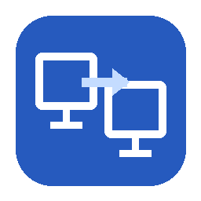

<p align="center">
  
</p>

<h1 align="center">TaskbarFetch</h1>

<p align="center">
  Move an existing application window to the monitor whose taskbar button you clicked.
</p>

<p align="center">
  <strong>Created and maintained by Thyann Seng</strong>
</p>

> **Latest GitHub release: v1.0.0-beta.1 (pre-release).** A local v1.0.0-beta.2 test build is being validated before publication. Please use the [multi-monitor test checklist](docs/TESTING.md) to validate your setup.

TaskbarFetch is a lightweight Windows 11 tray utility for multi-monitor setups. It makes the Windows taskbar behave in a way many multi-monitor users expect: if an application's window is on one monitor and you click that application's taskbar button on another monitor, TaskbarFetch moves the existing window to the monitor you clicked.

It is intentionally small and local-only. TaskbarFetch uses Windows Forms, Win32 hooks, and Microsoft Active Accessibility. It does not use Electron, run a background service, require a server, send telemetry, or require administrator privileges for normal desktop applications.

## What it does

Suppose Chrome is open on Monitor 1:

```text
Monitor 1                         Monitor 2
┌────────────────────────┐        ┌────────────────────────┐
│                        │        │                        │
│      Chrome            │        │                        │
│                        │        │                        │
├────────────────────────┤        ├────────────────────────┤
│ [Chrome] [Explorer]    │        │ [Chrome] [Explorer]    │
└────────────────────────┘        └────────────────────────┘
                                             ↑
                                      click Chrome here
```

TaskbarFetch moves the existing Chrome window to Monitor 2 and activates it.

## Features

- Move an existing application window to the monitor whose taskbar button was clicked.
- Support the primary and secondary standard Windows 11 taskbars.
- Preserve maximized windows when moving them.
- Restore and move minimized windows when appropriate.
- Preserve normal Windows minimize behavior when you click the application's taskbar button on the same monitor.
- Support grouped applications by keeping the target monitor pending while you choose a taskbar thumbnail.
- Map normal window position and size proportionally between monitors.
- Handle different monitor resolutions, work areas, and DPI scaling.
- Support monitor layouts that use negative desktop coordinates.
- Pause or resume from the system tray.
- Optional per-user startup with Windows.
- Local diagnostic logging.
- No telemetry and no network communication.

## Requirements

- Windows 11
- The standard Windows Explorer taskbar
- Two or more monitors for the primary use case
- .NET Framework 4.8 or later to run TaskbarFetch
- .NET 10 SDK or newer to build from source

For the intended workflow, enable:

**Settings > Personalization > Taskbar > Taskbar behaviors > Show my taskbar on all displays**

If Windows offers a setting for where taskbar app buttons appear, choose an option that displays the relevant application button on the monitor from which you want to move the window.

## Installation

### Install from a GitHub release

Download and run the **TaskbarFetch Setup** `.exe` from the repository's [Releases](https://github.com/ThyannSeng/TaskbarFetch/releases) page. Follow the setup wizard. It installs for the current Windows user at:

```text
%LOCALAPPDATA%\Programs\TaskbarFetch
```

Setup adds TaskbarFetch to the Start menu and Windows' installed apps list. No administrator rights are required. The wizard offers a **Start TaskbarFetch automatically when I sign in** option; this can also be changed later from the tray menu. On the final page, leave **Launch TaskbarFetch** checked to start it immediately.

When updating, close TaskbarFetch from its system-tray menu first. Setup detects a running copy and asks you to close it; it does not force-close the application.

To uninstall, use **Settings > Apps > Installed apps > TaskbarFetch > Uninstall** or the TaskbarFetch entry in the Start menu. The uninstaller removes the managed program files, Start menu shortcut, and startup entry if it still points to the installed TaskbarFetch executable. Personal settings and diagnostic logs are preserved.

### Build the setup program from source

Install the Inno Setup 6.7.3 compiler from its [official downloads page](https://jrsoftware.org/isdl.php), then run:

```powershell
.\TaskbarFetch-Setup-Build.cmd
```

The command rebuilds the portable app from the current source, then creates both files in the project folder:

```text
TaskbarFetch-Portable-v<version>.exe
TaskbarFetch-Setup-v<version>.exe
```

When that setup program is run from this source checkout, it also creates a `TaskbarFetch.lnk` shortcut in the project folder that points to the installed app. A setup program downloaded from a release does not create a shortcut beside the downloaded file.

Inno Setup 6.7.3 is free for non-commercial use. Review its [license terms](https://jrsoftware.org/isorder.php) if TaskbarFetch will be used in a commercial context.

Open `TaskbarFetch.sln` in Visual Studio to work with the application and automated tests, or open `TaskbarFetch.csproj` for the application alone. MSBuild uses the same versioned portable filename as the command-line build.

## Portable use

Run `TaskbarFetch-Portable-v<version>.exe` directly from the project folder, or extract the portable release ZIP and run that versioned executable. `TaskbarFetch-Portable-Build.cmd` reads the version from `Directory.Build.props` and generates the matching filename. The optional launcher opens the executable for the current project version and rebuilds it if it is missing or older than its source files:

```text
TaskbarFetch-Portable-Launch.cmd
```

Portable use does not create an installed-app entry or Start menu shortcut, and the Windows uninstaller does not remove portable copies. Before deleting or moving a portable executable, turn off **Start with Windows** from the tray menu if it is enabled.

## Tray menu

Right-click the TaskbarFetch icon in the notification area:

- **Pause / Resume** temporarily disables or enables window-moving behavior.
- **Move already-active window to clicked monitor** controls whether a window that remains active is moved when its taskbar button is clicked on another monitor. This setting is enabled by default and saved for the current user.
- **Start with Windows** toggles per-user startup.
- **Open log folder** opens TaskbarFetch's local diagnostic folder.
- **About** displays the application version and creator credit.
- **Exit** closes TaskbarFetch and removes its hooks.

Double-clicking the tray icon also toggles Pause/Resume.

## Behavior details

### Clicking an app on another monitor

If an application is on Monitor 1 and you click its taskbar button on Monitor 2, the selected application window is moved to Monitor 2.

When **Move already-active window to clicked monitor** is enabled, clicking the taskbar button of a window that stays active moves it to the clicked monitor even if Windows does not minimize or otherwise switch it first. Turn off this option in the tray menu to leave that window on its current monitor.

### Clicking an app on its current monitor

TaskbarFetch does not intentionally override ordinary Windows behavior. For example, clicking an already-active application's taskbar button on the same monitor can still minimize it normally.

### Grouped taskbar buttons

If an application has several top-level windows and Windows displays thumbnail previews, TaskbarFetch remembers the monitor whose taskbar button you clicked. After you choose the desired thumbnail, that selected window becomes the movement target.

### Maximized windows

A maximized window remains maximized after being moved.

### Normal windows

A normal window's restored rectangle is mapped proportionally from the source monitor's work area to the destination monitor's work area. The result is clamped so that the window remains reachable.

This is useful when your monitors have different resolutions or scaling values.

## Privacy

TaskbarFetch is designed to operate entirely on your PC.

It:

- does not hook the keyboard;
- observes left mouse clicks only for taskbar interaction detection;
- observes foreground-window changes;
- does not transmit data over the network;
- does not include analytics or telemetry;
- does not log window titles or taskbar button names.

Logs are stored locally under:

```text
%LOCALAPPDATA%\TaskbarFetch
```

## Elevated applications

Windows User Interface Privilege Isolation can prevent a normal unelevated process from repositioning an administrator-elevated window.

TaskbarFetch deliberately runs without elevation because ordinary applications should not require TaskbarFetch itself to have administrator privileges. If an elevated application cannot be moved, that can be a Windows security boundary rather than a TaskbarFetch monitor-detection failure.

## Third-party taskbars

TaskbarFetch targets the standard Windows Explorer taskbar classes:

```text
Shell_TrayWnd
Shell_SecondaryTrayWnd
```

Third-party taskbar replacements or heavily modified Explorer shells may expose different window classes or accessibility structures and are not guaranteed to work.

## How it works

At a high level, TaskbarFetch uses:

- `WH_MOUSE_LL` to observe taskbar mouse clicks;
- `MonitorFromPoint` to identify the clicked monitor;
- `AccessibleObjectFromPoint` as an advisory taskbar-control hit-test;
- `SetWinEventHook(EVENT_SYSTEM_FOREGROUND)` to observe the window selected by Windows;
- `SetWindowPos` and related window-state APIs to move the selected top-level window;
- Per-Monitor V2 DPI awareness;
- a dedicated STA worker for accessibility work so the low-level mouse hook remains fast.

See [docs/ARCHITECTURE.md](docs/ARCHITECTURE.md) for more detail.

## Building

### Simple Windows build

```bat
TaskbarFetch-Portable-Build.cmd
```

`TaskbarFetch-Portable-Build.cmd` requires the .NET 10 SDK or newer. It reads the version from `Directory.Build.props`, builds `TaskbarFetch.csproj` in Release configuration, checks the executable's embedded version metadata, and copies the matching versioned executable into the project folder. The application targets .NET Framework 4.8; the .NET SDK is the build toolchain. For example, project version `1.0.0-beta.2` creates:

```text
TaskbarFetch-Portable-v1.0.0-beta.2.exe
```

### Visual Studio / MSBuild

Open `TaskbarFetch.sln` or build `TaskbarFetch.csproj` with MSBuild on Windows using the .NET 10 SDK or newer. The application itself targets .NET Framework 4.8.

## Repository layout

- `src\`: app entry point, tray UI, hook coordination, accessibility, window management, preferences, logging, and native API definitions.
- `scripts\`: portable build, version validation, optional launcher, and CI setup helpers.
- `installer\`: Inno Setup source and the setup-build helper.
- `tests\`: platform-independent geometry tests and Windows installer lifecycle checks.
- `docs\`: architecture, manual test matrix, and publishing instructions.
- `assets\`: TaskbarFetch icon files and their generator.

## Testing

Run `dotnet restore .\tests\TaskbarFetch.GeometryTests\TaskbarFetch.GeometryTests.csproj --locked-mode`, then `dotnet test .\tests\TaskbarFetch.GeometryTests\TaskbarFetch.GeometryTests.csproj --configuration Release --no-restore` for reproducible automated geometry checks; these require the .NET 10 SDK. The most important behavior still depends on real Explorer taskbars and monitor topology; see [docs/TESTING.md](docs/TESTING.md) for the manual regression matrix used for multi-monitor validation.

## Report a bug

If TaskbarFetch does not move a window as expected, please [open a GitHub bug report](https://github.com/ThyannSeng/TaskbarFetch/issues/new?template=bug_report.yml). Include your Windows version, monitor arrangement, resolutions, scaling percentages, steps to reproduce, and whether any taskbar customization software is installed. You can also include relevant lines from `%LOCALAPPDATA%\TaskbarFetch\TaskbarFetch.log`; review the log before sharing it. TaskbarFetch does not record window titles or taskbar button names.

## Uninstall

Use **Settings > Apps > Installed apps > TaskbarFetch > Uninstall**, or select **Uninstall TaskbarFetch** from the Start menu. Exit the tray app first. The uninstaller will not force-close a running copy. It removes the installed copy under `%LOCALAPPDATA%\Programs\TaskbarFetch` and its managed shortcuts; it does not delete the project source folder or portable `TaskbarFetch-Portable-v<version>.exe`. Diagnostic logs under `%LOCALAPPDATA%\TaskbarFetch` and saved preferences are preserved.

## Project ownership and icon provenance

TaskbarFetch is an independent implementation created by **Thyann Seng**.

The application icon is also an original TaskbarFetch asset. The deterministic source generator is included at:

```text
assets/generate_icon.py
```

This allows the PNG and Windows ICO assets to be regenerated directly from repository source. See [THIRD_PARTY_NOTICES.md](THIRD_PARTY_NOTICES.md) for additional provenance information.

## Contributing

Contributions and reproducible bug reports are welcome. Please read [CONTRIBUTING.md](CONTRIBUTING.md) before opening a pull request.

## License

TaskbarFetch is released under the [MIT License](LICENSE).

Copyright © 2026 **Thyann Seng**.

TaskbarFetch is not affiliated with or endorsed by Microsoft. Windows and Microsoft are trademarks of Microsoft Corporation.
